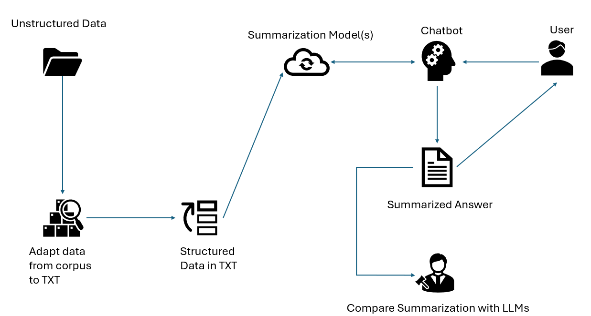

# Intelligent Document Processing and Summarization Pipeline

## 🌟 Project Overview

This project implements an advanced document processing pipeline designed to extract, analyze, and summarize complex textual documents, with a specific focus on scholarship and official document analysis. The system leverages state-of-the-art natural language processing techniques to transform unstructured PDF documents into structured, insightful summaries.



## 🎯 Project Objectives

- Automatically extract structured information from PDF documents
- Perform topic modeling and clustering of document sections
- Generate summaries using multiple state-of-the-art language models
- Evaluate and compare summarization performance

## 🛠 System Architecture

The pipeline consists of several key components:

1. **PDF to Text Conversion** (`pdf_totext.py`)
   - Converts PDF documents to clean, structured text
   - Removes unnecessary metadata and formatting

2. **Topic Modeling** (`transformer_topic_modeling.py`)
   - Utilizes transformer-based embeddings
   - Clusters document sections into predefined categories
   - Extracts most relevant sections for each topic

3. **Summarization** (`summarization_models.py`)
   - Supports multiple summarization models:
     - BART
     - T5
     - Longformer
   - Generates summaries at both article and document levels

4. **Evaluation** (`llm_evaluator.py`)
   - Compares summaries generated by different models
   - Provides quantitative assessment of summary quality

5. **Pipeline Orchestration** (`pipeline.py`)
   - Coordinates the entire document processing workflow
   - Manages input, processing, and output of documents

## 📦 Prerequisites

- Python 3.8+
- PyTorch
- Transformers
- Sentence-Transformers
- scikit-learn
- tqdm
- huggingface_hub

## 🚀 Installation

```bash
# Clone the repository
git clone https://github.com/gsolersanz/NPL_becas_BOE.git
cd document-processing-pipeline

```

## 🔧 Usage

### Basic Pipeline Execution

```bash
python pipeline.py --input document1.pdf document2.txt 
                   --output results 
                   --summarization_models bart t5 
                   --evaluate
```

### Command Line Arguments

- `--input`: One or more input files to process (PDF or TXT)
- `--output`: Base directory for storing results
- `--num_topics`: Number of topics for clustering (default: 3)
- `--custom_topics`: Specify custom topics (e.g., "requisitos_academicos")
- `--summarization_models`: Models to use for summarization 
  - Choices: bart, t5, longformer
- `--evaluate`: Flag to evaluate and compare summaries with LLM, in the actual implementation you can choose between gpt-2 for spanish or gpt-2.

## 📂 Project Structure

- `pipeline.py`: Main pipeline orchestration script
- `pdf_totext.py`: PDF to text conversion
- `transformer_topic_modeling.py`: Advanced topic modeling
- `summarization_models.py`: Text summarization
- `llm_evaluator.py`: Summary evaluation
- `cluster_becas.py`: Additional clustering utilities

## 📊 Example Workflow

1. Input PDF/TXT documents
2. Convert to clean text
3. Extract and cluster document sections
4. Generate summaries using multiple models
5. Evaluate and compare summaries
6. Output structured results


## 📈 Performance Evaluation

The system provides:
- Topic distribution analysis
- Summary quality metrics
- Comparative model performance
